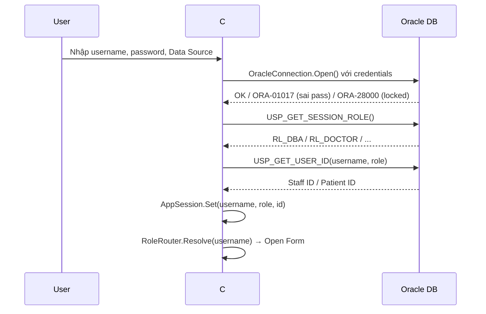
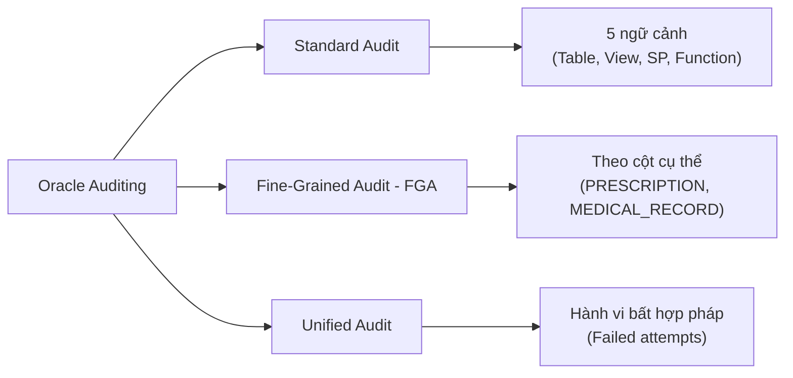
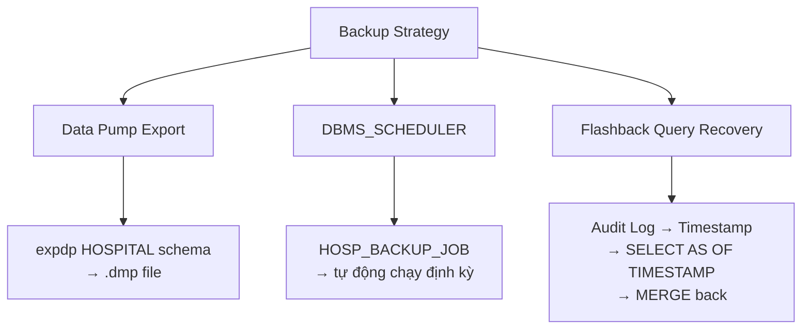
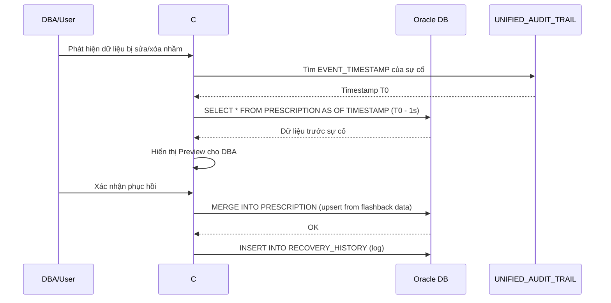

# 📋 Cấu Trúc Báo Cáo — Phân Hệ 1 + 2
## Hệ thống Quản Lý Dữ Liệu Y Tế (QuanLyYTe)

> **Môn học:** An toàn và bảo mật hệ thống thông tin
> **Nền tảng:** Oracle Database 21c XE · C# WinForms · Oracle Managed Data Access

---

## Mục Lục Tổng Quan

| Phần | Nội Dung | Thuộc Phân Hệ |
|------|----------|---------------|
| I | Giới thiệu hệ thống | Chung |
| II | Thiết kế cơ sở dữ liệu | PH1 |
| III | Quản lý người dùng & vai trò | PH1 |
| IV | Phân quyền (Cấp / Thu hồi) | PH1 |
| V | Kiểm soát truy cập theo vai trò (RBAC) | PH1 + PH2 |
| VI | VPD – Virtual Private Database | PH2 |
| VII | OLS – Oracle Label Security | PH2 |
| VIII | Kiểm toán (Auditing) | PH2 |
| IX | Sao lưu & Phục hồi | PH2 |
| X | Ứng dụng C# WinForms | PH1 + PH2 |
| XI | Kết luận | Chung |

---

## I. Giới Thiệu Hệ Thống

### 1.1 Bối cảnh & Mục tiêu
- Mô tả bài toán: Hệ thống quản lý dữ liệu y tế cho bệnh viện
- Mục tiêu bảo mật: Áp dụng các cơ chế bảo mật Oracle vào quản lý dữ liệu nhạy cảm (hồ sơ bệnh nhân, đơn thuốc, kết quả xét nghiệm)
- Phạm vi phân hệ 1 & 2

### 1.2 Kiến Trúc Tổng Quan

```
┌─────────────────────────────────────────────────────────────┐
│                    C# WinForms Application                  │
│  ┌──────────┐ ┌──────────┐ ┌──────────┐ ┌────────────────┐ │
│  │  Login   │ │ Dashboard│ │Role Forms│ │ Backup/Recovery│ │
│  └────┬─────┘ └────┬─────┘ └────┬─────┘ └───────┬────────┘ │
│       │            │            │                │          │
│  ┌────┴────────────┴────────────┴────────────────┴────────┐ │
│  │              Services Layer (Business Logic)           │ │
│  │  AuthService · CoordinatorService · DoctorService ...  │ │
│  └────────────────────────┬───────────────────────────────┘ │
│  ┌────────────────────────┴───────────────────────────────┐ │
│  │              Repository Layer (Data Access)            │ │
│  │  AuthRepo · CoordinatorRepo · DoctorRepo · ...        │ │
│  └────────────────────────┬───────────────────────────────┘ │
│  ┌────────────────────────┴───────────────────────────────┐ │
│  │         OracleDbProvider · OracleConnectionFactory     │ │
│  └────────────────────────┬───────────────────────────────┘ │
└───────────────────────────┼─────────────────────────────────┘
                            │ ODP.NET (Oracle Managed Data Access)
┌───────────────────────────┼─────────────────────────────────┐
│                 Oracle Database 21c XE                       │
│  ┌─────────────────────────────────────────────────────────┐│
│  │                      PDB_QLYT                           ││
│  │  ┌──────────┐ ┌───────────┐ ┌─────────┐ ┌───────────┐  ││
│  │  │ HOSPITAL │ │HOSPITAL_  │ │ LBACSYS │ │  SYS/DBA  │  ││
│  │  │ (Schema) │ │   DBA     │ │  (OLS)  │ │ (Auditor) │  ││
│  │  └──────────┘ └───────────┘ └─────────┘ └───────────┘  ││
│  │                                                         ││
│  │  ┌─── Security Stack ───────────────────────────────┐   ││
│  │  │ RBAC · VPD · OLS · Standard Audit · FGA · Unified│   ││
│  │  └──────────────────────────────────────────────────┘   ││
│  └─────────────────────────────────────────────────────────┘│
└─────────────────────────────────────────────────────────────┘
```

### 1.3 Công nghệ sử dụng
- **Database:** Oracle 21c XE, PDB: `PDB_QLYT`
- **Application:** C# .NET WinForms
- **ORM/Driver:** Oracle Managed Data Access (ODP.NET)
- **Security:** Oracle RBAC, VPD (DBMS_RLS), OLS (Label Security), Auditing, Data Pump, Flashback Query

### 1.4 Sơ Đồ Phân Chia Schema

| Schema | Vai trò | Trạng thái |
|--------|---------|------------|
| `HOSPITAL` | Chứa toàn bộ bảng nghiệp vụ (DEPARTMENT, STAFF, PATIENT, MEDICAL_RECORD, ...) | Account **LOCKED** – không ai đăng nhập trực tiếp |
| `HOSPITAL_DBA` | DBA ứng dụng – quản lý view, SP, VPD policy, OLS admin | Active |
| `SYS` | SYSDBA – Audit policy, hệ thống | Dùng khi setup |
| `LBACSYS` | OLS kernel | Dùng khi setup |

---

## II. Thiết Kế Cơ Sở Dữ kết (Phân Hệ 1)

### 2.1 Lược đồ quan hệ (ERD)

> [!TIP]
> Vẽ ERD 6 bảng chính với các mối quan hệ FK.

```mermaid
erDiagram
    DEPARTMENT ||--o{ STAFF : "1:N"
    DEPARTMENT ||--o{ MEDICAL_RECORD : "1:N"
    PATIENT ||--o{ MEDICAL_RECORD : "1:N"
    STAFF ||--o{ MEDICAL_RECORD : "doctor"
    MEDICAL_RECORD ||--o{ SERVICE_RECORD : "1:N"
    MEDICAL_RECORD ||--o{ PRESCRIPTION : "1:N"
    STAFF ||--o{ SERVICE_RECORD : "technician"

    DEPARTMENT {
        VARCHAR2 dept_id PK
        NVARCHAR2 dept_name
    }
    STAFF {
        VARCHAR2 staff_id PK
        NVARCHAR2 full_name
        NVARCHAR2 gender
        DATE birthdate
        VARCHAR2 id_card UK
        NVARCHAR2 hometown
        VARCHAR2 phone
        VARCHAR2 dept_id FK
        NVARCHAR2 staff_role
        VARCHAR2 username_db UK
        NUMBER is_active
    }
    PATIENT {
        VARCHAR2 patient_id PK
        NVARCHAR2 full_name
        NVARCHAR2 gender
        DATE birthdate
        VARCHAR2 id_card UK
        NVARCHAR2 house_no
        NVARCHAR2 street
        NVARCHAR2 district
        NVARCHAR2 city_province
        NCLOB medical_history
        NCLOB family_medical_history
        NCLOB drug_allergies
        VARCHAR2 username_db UK
        NUMBER is_active
    }
    MEDICAL_RECORD {
        VARCHAR2 record_id PK
        VARCHAR2 patient_id FK
        DATE record_date
        NVARCHAR2 diagnosis
        NVARCHAR2 treatment_plan
        VARCHAR2 doctor_id FK
        VARCHAR2 dept_id FK
        NVARCHAR2 conclusion
    }
    SERVICE_RECORD {
        VARCHAR2 record_id PK_FK
        NVARCHAR2 service_type PK
        DATE service_date PK
        VARCHAR2 technician_id FK
        NVARCHAR2 service_result
    }
    PRESCRIPTION {
        VARCHAR2 record_id PK_FK
        DATE prescription_date PK
        NVARCHAR2 medicine_name PK
        NVARCHAR2 dosage
    }
```

### 2.2 Chi tiết các bảng

Mô tả từng bảng, cột, kiểu dữ liệu, constraint (PK, FK, CHECK, UNIQUE).

**Các bảng chính:**
1. **DEPARTMENT** – Phòng/Khoa (3 phòng: Nội tổng quát, Ngoại thần kinh, Chẩn đoán hình ảnh)
2. **STAFF** – Nhân viên (Bác sĩ, Điều phối viên, Kỹ thuật viên)
3. **PATIENT** – Bệnh nhân
4. **MEDICAL_RECORD** – Hồ sơ bệnh án
5. **SERVICE_RECORD** – Phiếu dịch vụ xét nghiệm (Composite PK)
6. **PRESCRIPTION** – Đơn thuốc (Composite PK)

**Bảng phụ trợ (Part 2):**
7. **NOTIFICATION** – Thông báo nội bộ (OLS-enabled, có cột `OLS_LABEL`)
8. **COORD_ASSIGNMENT_STAFF** – Bảng phụ tối thiểu cho Điều phối viên phân công
9. **BACKUP_HISTORY** – Lịch sử sao lưu
10. **RECOVERY_HISTORY** – Lịch sử phục hồi

### 2.3 Sequence & Trigger

| Đối tượng | Mục đích |
|-----------|----------|
| `SEQ_STAFF_ID` | Auto-generate mã nhân viên (bắt đầu 171) |
| `SEQ_PATIENT_ID` | Auto-generate mã bệnh nhân (bắt đầu 100001) |
| `SEQ_NOTIFICATION_ID` | Auto-generate mã thông báo OLS |
| `TRG_VALIDATE_MEDICAL_RECORD` | Ngăn tạo hồ sơ với bác sĩ/bệnh nhân đã bị khóa |
| `TRG_VALIDATE_SERVICE_RECORD` | Ngăn tạo dịch vụ với kỹ thuật viên đã bị khóa |

### 2.4 Cơ chế Liên kết DB User ↔ Application Data

> [!IMPORTANT]
> **Thiết kế cốt lõi:** Mỗi DB user tương ứng 1-1 với một bản ghi trong bảng `STAFF` hoặc `PATIENT` qua cột `username_db`. Cơ chế này là nền tảng cho VPD (`SESSION_USER`) và RBAC.

```
DB User: NV000021  ←→  STAFF.username_db = 'NV000021'  (Bác sĩ)
DB User: BN000001  ←→  PATIENT.username_db = 'BN000001' (Bệnh nhân)
```

---

## III. Quản Lý Người Dùng & Vai Trò (Phân Hệ 1)

### 3.1 Hệ thống vai trò (Roles)

| Role | Mô tả | Quyền chính |
|------|--------|-------------|
| `RL_DBA` | Quản trị viên ứng dụng | CREATE/ALTER/DROP USER, ROLE; GRANT/REVOKE; SELECT ANY DICTIONARY |
| `RL_COORDINATOR` | Điều phối viên | Quản lý hồ sơ, phân công, xem danh sách bác sĩ/kỹ thuật viên |
| `RL_DOCTOR` | Bác sĩ | Xem/Sửa hồ sơ bệnh án, kê đơn thuốc |
| `RL_TECHNICIAN` | Kỹ thuật viên | Cập nhật kết quả dịch vụ/xét nghiệm |
| `RL_PATIENT` | Bệnh nhân | Xem hồ sơ cá nhân, cập nhật thông tin liên lạc |

### 3.2 Stored Procedures quản lý user

| Procedure | Chức năng | Cơ chế |
|-----------|-----------|--------|
| `USP_CREATE_USER` | Tạo DB user thuần | `CREATE USER` + `GRANT CREATE SESSION` |
| `USP_CREATE_USER_LINKED` | Tạo DB user + INSERT vào bảng STAFF/PATIENT | Atomic transaction: tạo user → grant role → insert data |
| `USP_UPDATE_USER_LINKED` | Cập nhật thông tin user liên kết | Phát hiện chuyển đổi Staff↔Patient và chặn |
| `USP_DROP_USER_LINKED` | Soft-delete: Lock account + set `is_active=0` | **Không** xóa dữ liệu, chỉ khóa |
| `USP_LOCK_USER` / `USP_UNLOCK_USER` | Khóa/Mở tài khoản | `ALTER USER ... ACCOUNT LOCK/UNLOCK` + sync `is_active` |
| `USP_DROP_USER` | Hard-delete user (CASCADE) | Chặn Oracle-maintained users |
| `USP_UPDATE_USER_PASSWORD` | Đổi mật khẩu | Chặn Oracle-maintained users |

### 3.3 Stored Procedures quản lý role

| Procedure | Chức năng |
|-----------|-----------|
| `USP_CREATE_ROLE` | Tạo role (tùy chọn password-protected) |
| `USP_UPDATE_ROLE_PASSWORD` | Cập nhật / gỡ password của role |
| `USP_DROP_ROLE` | Xóa role (chặn Oracle-maintained) |
| `USP_GRANT_ROLE_TO_USER` | Gán role + thu hồi role cũ (enforce 1 role/user) |

### 3.4 Cơ chế bảo vệ

- **Oracle-Maintained Guard:** Tất cả SP quản lý user/role đều kiểm tra `ORACLE_MAINTAINED = 'Y'` trước khi thực thi
- **1 Role Per User:** `USP_GRANT_ROLE_TO_USER` tự động revoke RL_* cũ trước khi grant mới
- **Cross-Type Guard:** `USP_UPDATE_USER_LINKED` ngăn chuyển đổi giữa Staff ↔ Patient
- **SQL Injection Prevention:** Sử dụng `DBMS_ASSERT.SIMPLE_SQL_NAME` và `DBMS_ASSERT.ENQUOTE_NAME`

---

## IV. Phân Quyền – Cấp & Thu Hồi (Phân Hệ 1)

### 4.1 Các loại quyền hỗ trợ

| Loại quyền | Ví dụ | Mechanism |
|------------|-------|-----------|
| **SYSTEM** | `CREATE SESSION`, `SELECT ANY TABLE` | `GRANT privilege TO grantee` |
| **ROLE** | `RL_DOCTOR`, `RL_COORDINATOR` | `GRANT role TO user` |
| **TABLE** | `SELECT ON HOSPITAL.STAFF` | `GRANT priv ON owner.table TO grantee` |
| **VIEW** | `SELECT ON V_COORD_DOCTORS` | Tương tự TABLE |
| **PROCEDURE/FUNCTION** | `EXECUTE ON USP_xxx` | `GRANT EXECUTE ON ...` |
| **COLUMN (Native)** | `UPDATE(conclusion) ON MEDICAL_RECORD` | Oracle native column-level grant |
| **COLUMN (Dynamic View)** | Column-level SELECT via restricted view | Tạo view `V_PRIV_{TABLE}_{USER}` |

### 4.2 Stored Procedure: `USP_GRANT_OBJECT_PRIVILEGE`

**Cơ chế Column-Level SELECT (qua Restricted View):**

```
User yêu cầu: GRANT SELECT (col1, col2) ON PATIENT TO NV000021

Oracle KHÔNG hỗ trợ column-level SELECT natively.
→ Solution: Tạo VIEW tự động:

  CREATE VIEW hospital.V_PRIV_PATIENT_NV000021 
  AS SELECT col1, col2 FROM hospital.PATIENT;

  GRANT SELECT ON hospital.V_PRIV_PATIENT_NV000021 TO NV000021;
```

**Column-Level UPDATE (Native):**
```
GRANT UPDATE (conclusion, treatment_plan) ON hospital.MEDICAL_RECORD TO NV000021;
```

### 4.3 Stored Procedure: `USP_REVOKE_PRIV`

- **Dynamic View detection:** Nếu object bắt đầu bằng `V_PRIV_`, thay vì REVOKE thì **DROP VIEW**
- **Column privilege parsing:** Trích xuất tên bảng gốc từ chuỗi `"PATIENT (BIRTHDATE)"`
- **Oracle-Maintained Guard:** Chặn revoke từ system accounts

### 4.4 Stored Procedure: `USP_GET_ALL_PRIVS`

Truy vấn hợp nhất 5 nguồn quyền:
1. `DBA_SYS_PRIVS` – System privileges
2. `DBA_ROLE_PRIVS` – Role assignments
3. `DBA_TAB_PRIVS` + `DBA_OBJECTS` – Object privileges (loại trừ V_PRIV_* views)
4. `DBA_COL_PRIVS` – Native column privileges
5. `DBA_TAB_PRIVS` (lọc `V_PRIV_*`) – Dynamic column-SELECT views

### 4.5 WITH GRANT OPTION / WITH ADMIN OPTION

- `WITH GRANT OPTION`: Cho phép user cấp lại quyền object cho người khác
- `WITH ADMIN OPTION`: Cho phép user cấp lại quyền system/role
- **Guard:** Oracle không cho phép `WITH GRANT OPTION` khi cấp cho ROLE → bắt ORA-1926

---

## V. Kiểm Soát Truy Cập Theo Vai Trò – RBAC (Phân Hệ 1 + 2)

### 5.1 Ma trận phân quyền theo vai trò

| Bảng/View | RL_DBA | RL_COORDINATOR | RL_DOCTOR | RL_TECHNICIAN | RL_PATIENT |
|-----------|--------|----------------|-----------|---------------|------------|
| DEPARTMENT | Full | SELECT (with grant) | – | – | SELECT |
| STAFF | Full | Via VW_COORD_* | VPD (self only) | VPD (self only) | SELECT |
| PATIENT | Full | SELECT, UPDATE (4 cols) | Via VPD view | – | VPD (self only) |
| MEDICAL_RECORD | Full | Full (VPD filtered) | VPD (own dept) | – | Via V_MEDICAL_RECORD_PATIENT |
| SERVICE_RECORD | Full | Full (VPD filtered) | – | VPD (self only) | Via V_SERVICE_RECORD_PATIENT |
| PRESCRIPTION | Full | Full (VPD filtered) | Via SP only | – | Via V_PRESCRIPTION_PATIENT |
| NOTIFICATION | Full | SELECT + INSERT | SELECT | SELECT | SELECT |

### 5.2 RoleRouter – Điều hướng giao diện theo vai trò

```csharp
// Helpers/RoleRouter.cs
role switch {
    "RL_DBA"         → Dashboard (frmDBADashboard)
    "RL_DOCTOR"      → frmDoctor
    "RL_COORDINATOR" → frmCoordinator
    "RL_TECHNICIAN"  → frmTechnician
    "RL_PATIENT"     → frmPatient
}
```

### 5.3 Authentication Flow



---

## VI. VPD – Virtual Private Database (Phân Hệ 2)

### 6.1 Tổng quan VPD

> VPD (Virtual Private Database) sử dụng `DBMS_RLS` để tự động thêm điều kiện WHERE vào mọi câu SQL, giúp mỗi user chỉ thấy dữ liệu thuộc quyền truy cập của họ mà **KHÔNG CẦN SỬA ỨNG DỤNG**.

### 6.2 VPD Policy trên bảng STAFF

**Function:** `hospital.FN_VPD_STAFF_SELF`

```
Nếu CURRENT_USER = 'HOSPITAL' hoặc 'HOSPITAL_DBA' → return '1=1' (bypass)
Ngược lại → return "username_db = SYS_CONTEXT('USERENV', 'SESSION_USER')"
```

**Policies:**

| Policy Name | Statement | Hiệu ứng |
|-------------|-----------|-----------|
| `POL_VPD_STAFF_SELF_SELECT` | SELECT | Nhân viên query STAFF chỉ thấy dòng chính mình |
| `POL_VPD_STAFF_SELF_UPDATE` | UPDATE (PHONE, HOMETOWN) | Nhân viên chỉ sửa SĐT & quê quán của mình |

### 6.3 VPD Policy trên các bảng khác

> [!NOTE]
> Mở rộng mô tả cho từng VPD policy trên MEDICAL_RECORD (doctor sees own-dept records), SERVICE_RECORD (technician sees own records), v.v.

**Coordinator bypasses:** Sử dụng bảng phụ `COORD_ASSIGNMENT_STAFF` và views `VW_COORD_DOCTORS`, `VW_COORD_TECHNICIANS` để Coordinator có thể xem danh sách Bác sĩ/KTV mà không bị VPD chặn.

### 6.4 Patient Self-Service Views

| View | Mục đích | Cơ chế bảo mật |
|------|----------|----------------|
| `V_PATIENT_SELF` | Thông tin cá nhân | `WHERE username_db = SESSION_USER` |
| `V_MEDICAL_RECORD_PATIENT` | Hồ sơ bệnh án | JOIN patient → filter by SESSION_USER |
| `V_PRESCRIPTION_PATIENT` | Đơn thuốc | JOIN MR → JOIN Patient → filter |
| `V_SERVICE_RECORD_PATIENT` | Dịch vụ xét nghiệm | JOIN MR → JOIN Patient → filter |

**Column-level security:** Bệnh nhân chỉ được UPDATE 7 cột trên `V_PATIENT_SELF`:
`house_no, street, district, city_province, medical_history, family_medical_history, drug_allergies`

---

## VII. OLS – Oracle Label Security (Phân Hệ 2)

### 7.1 Kiến trúc OLS Policy

| Thành phần | Giá trị |
|------------|---------|
| **Policy Name** | `HOSP_OLS_POL` |
| **Label Column** | `OLS_LABEL` (trên bảng `NOTIFICATION`) |
| **Options** | `READ_CONTROL, WRITE_CONTROL, CHECK_CONTROL` |

### 7.2 Cấu trúc nhãn: Level : Compartment : Group

```
┌──────────────────────────────────────────────────┐
│            Label = LEVEL : COMP : GROUP          │
│                                                  │
│  LEVEL (Cấp bậc - Hierarchical)                 │
│  ├── BGD (3000) – Ban Giám Đốc                  │
│  ├── LDK (2000) – Lãnh Đạo Khoa                 │
│  └── NV  (1000) – Nhân Viên                     │
│                                                  │
│  COMPARTMENT (Khoa – Non-hierarchical)           │
│  ├── TH (100) – Khoa Tiêu Hóa                   │
│  ├── TK (200) – Khoa Thần Kinh                  │
│  └── TM (300) – Khoa Tim Mạch                   │
│                                                  │
│  GROUP (Cơ sở – Hierarchical)                    │
│  ├── HCM (10) – Hồ Chí Minh                     │
│  ├── HP  (20) – Hải Phòng                       │
│  └── HN  (30) – Hà Nội                          │
└──────────────────────────────────────────────────┘
```

### 7.3 Cơ chế Dominance (Ai thấy gì?)

> [!IMPORTANT]
> **Quy tắc:** User có label `L1:C1:G1` **đọc được** row có label `L2:C2:G2` khi:
> 1. `L1 >= L2` (Level user ≥ level row)
> 2. `C1 ⊇ C2` (Compartments của user chứa hết compartments của row)
> 3. `G1 ⊇ G2` (Groups của user chứa hết groups của row)

### 7.4 Test Data Labels (7 Thông báo)

| ID | Nội dung | Label | Ai đọc được? |
|----|----------|-------|-------------|
| T1 | Thông báo chung toàn viện | `NV` | Tất cả mọi người |
| T2 | Họp chiến lược Quý 3 | `BGD` | Chỉ Ban Giám Đốc |
| T3 | Đánh giá ngân sách | `LDK` | LĐK trở lên |
| T4 | Báo cáo thiết bị nội soi | `LDK:TH` | LĐK Khoa Tiêu Hóa trở lên |
| T5 | Thay đổi ca trực | `NV:TH:HCM` | NV Tiêu Hóa tại HCM |
| T6 | Tập huấn an toàn | `NV:TH:HN` | NV Tiêu Hóa tại Hà Nội |
| T7 | Họp liên khoa TH & TK | `LDK:TH,TK:HP` | LĐK Tiêu Hóa+Thần Kinh tại Hải Phòng |

### 7.5 User Labels (8 test users: U1 – U8)

| User | Label | Thấy T? |
|------|-------|---------|
| U1 | `BGD:TH,TK,TM:HCM,HP,HN` | T1,T2,T3,T4,T5,T6,T7 (tất cả) |
| U2 | `LDK:TM:HCM` | T1,T3 |
| U3 | `LDK:TK:HN` | T1,T3 |
| U4 | `NV:TK:HCM` | T1 |
| U5 | `NV:TM:HCM` | T1 |
| U6 | `LDK:TM:HCM` | T1,T3 |
| U7 | `LDK:TH,TK,TM:HCM,HP,HN` | T1,T3,T4,T7 |
| U8 | `NV:TH:HN` | T1,T6 |

### 7.6 Tổ hợp nhãn (192 labels)

- 3 Levels × 8 Compartment combos × 8 Group combos = **192 valid labels**
- Oracle OLS **bắt buộc** phải khởi tạo tường minh từng nhãn hợp lệ bằng `SA_LABEL_ADMIN.CREATE_LABEL`
- Script tự động sinh bằng nested loop PL/SQL

### 7.7 SP quản lý OLS từ ứng dụng

| Procedure | Chức năng |
|-----------|-----------|
| `USP_GET_NOTIFICATIONS` | Đọc thông báo (tự động filter bởi OLS) |
| `USP_ADD_NOTIFICATION` | Tạo thông báo với label string |
| `USP_GET_USER_OLS_LABEL` | Xem label hiện tại của user |
| `USP_SET_USER_OLS_LABEL` | Cấp/Thay đổi label cho user (DBA) |

---

## VIII. Kiểm Toán – Auditing (Phân Hệ 2)

### 8.1 Ba cơ chế kiểm toán



### 8.2 Standard Audit (5 ngữ cảnh)

| # | Đối tượng | Hành động | Khi nào | Mục đích |
|---|-----------|-----------|---------|----------|
| 1 | `STAFF` (Table) | DELETE | Success + Failed | Phát hiện xóa nhân viên |
| 2 | `PATIENT` (Table) | UPDATE | Success + Failed | Theo dõi sửa thông tin bệnh nhân |
| 3 | `VW_COORD_DOCTORS` (View) | SELECT | Success + Failed | Kiểm tra tra cứu danh sách bác sĩ |
| 4 | `USP_UPDATE_MEDICAL_RECORD` (SP) | EXECUTE | Success + Failed | Kiểm toán cập nhật hồ sơ bệnh án |
| 5 | `F_GET_DOCTOR_STATS` (Function) | EXECUTE | Success + Failed | Kiểm toán gọi function thống kê |

**SP đọc log:** `USP_GET_REQ32_LOGS` → query `DBA_AUDIT_TRAIL`

### 8.3 Fine-Grained Audit (FGA)

| Policy | Bảng | Cột | Statement | Mục đích |
|--------|------|-----|-----------|----------|
| `FGA_PRESCRIPTION_COLS` | PRESCRIPTION | `RECORD_ID, PRESCRIPTION_DATE, MEDICINE_NAME, DOSAGE` | UPDATE | Theo dõi thay đổi đơn thuốc |
| `FGA_MEDICAL_RECORD_COLS` | MEDICAL_RECORD | `DIAGNOSIS, TREATMENT_PLAN, CONCLUSION` | UPDATE | Theo dõi thay đổi chẩn đoán |

**SP đọc log:**
- `USP_GET_REQ33A_LOGS` → `DBA_FGA_AUDIT_TRAIL` cho PRESCRIPTION
- `USP_GET_REQ33BC_LOGS` → `DBA_FGA_AUDIT_TRAIL` (Success) + `UNIFIED_AUDIT_TRAIL` (Failed)

### 8.4 Unified Audit (Hành vi bất hợp pháp)

| Policy | Bảng | Hành động | Khi nào | Mục đích |
|--------|------|-----------|---------|----------|
| `AUD_ILLEGAL_MR_POLICY` | MEDICAL_RECORD | UPDATE | `WHENEVER NOT SUCCESSFUL` | Bắt hành vi sửa HSBA trái phép |
| `AUD_ILLEGAL_SR_POLICY` | SERVICE_RECORD | INSERT, UPDATE, DELETE | `WHENEVER NOT SUCCESSFUL` | Bắt hành vi thao tác dịch vụ trái phép |
| `audit_prescription_recovery_policy` | PRESCRIPTION | UPDATE, DELETE | Always | Hỗ trợ Flashback Recovery |

**SP đọc log:** `USP_GET_REQ33D_LOGS` → `UNIFIED_AUDIT_TRAIL`

### 8.5 Giao diện kiểm toán (4 tab)

| Tab | Dữ liệu | Nguồn |
|-----|----------|-------|
| Kiểm toán hệ thống | 5 ngữ cảnh Standard | `DBA_AUDIT_TRAIL` |
| Đơn thuốc | FGA trên PRESCRIPTION | `DBA_FGA_AUDIT_TRAIL` |
| Hồ sơ bệnh án | FGA (Success) + Unified (Failed) | Kết hợp 2 nguồn |
| Dịch vụ | Unified (Failed) | `UNIFIED_AUDIT_TRAIL` |

---

## IX. Sao Lưu & Phục Hồi – Backup & Recovery (Phân Hệ 2)

### 9.1 Kiến trúc Backup



### 9.2 Backup cơ chế

| Thành phần | Cơ chế |
|------------|--------|
| **Directory** | `HOSPITAL_BACKUP_DIR` → `C:\OracleBackups` |
| **Export** | `DBMS_DATAPUMP` API → export schema `HOSPITAL` |
| **Lịch sử** | Ghi vào `BACKUP_HISTORY` (backup_id, time, type, status, dump_file, log_file) |
| **Auto Backup** | `DBMS_SCHEDULER.CREATE_JOB('HOSP_BACKUP_JOB')` chạy định kỳ |

### 9.3 Recovery cơ chế: Flashback Query + Audit Log



### 9.4 Data Pump Import (Full Restore)

- PowerShell script: `Run-DataPumpImportToRestore.ps1`
- Import .dmp file → tạo staging schema → copy data back

### 9.5 SP Backup & Recovery

| Procedure | Chức năng |
|-----------|-----------|
| `USP_BACKUP_DATAPUMP` | Thực thi Data Pump Export |
| `USP_GET_BACKUP_HISTORY` | Lịch sử sao lưu |
| `USP_FIND_PRESCRIPTION_AUDIT_EVENTS` | Tìm sự cố từ Audit Trail |
| `USP_PREVIEW_PRESCRIPTION_FLASHBACK` | Xem trước dữ liệu cần phục hồi |
| `USP_RECOVER_PRESCRIPTION_FLASHBACK` | Thực thi phục hồi bằng Flashback |
| `USP_GET_RECOVERY_HISTORY` | Lịch sử phục hồi |

---

## X. Ứng Dụng C# WinForms (Phân Hệ 1 + 2)

### 10.1 Kiến trúc phần mềm (3-Layer)

```
┌─────────────────────────────────────┐
│ PRESENTATION LAYER (Forms/)         │
│  Auth/   DBA/   Coordinator/        │
│  Doctor/ Technician/ Patient/       │
│  BackupRecovery/ Common/            │
├─────────────────────────────────────┤
│ BUSINESS LOGIC LAYER (Services/)    │
│  AuthService · CoordinatorService   │
│  DoctorService · TechnicianService  │
│  PatientService · PrivilegeService  │
│  SecurityAdminService               │
│  BackupRecoveryService              │
├─────────────────────────────────────┤
│ DATA ACCESS LAYER                   │
│  Repositories/ (per-role repos)     │
│  DataProvider/ (OracleDbProvider)   │
│  Common/ (AppSession, Logger,       │
│           OracleErrorMapper)        │
└─────────────────────────────────────┘
```

### 10.2 Danh sách Forms theo vai trò

| Vai trò | Form chính | Chức năng |
|---------|------------|-----------|
| **Auth** | `frmLogin` | Đăng nhập Oracle, xác thực vai trò |
| **DBA** | `frmDBADashboard` | Tổng quan quản trị |
| | `frmUserManagement` | CRUD user (linked + unlinked) |
| | `frmEditUser` | Form chỉnh sửa user chi tiết |
| | `frmGrantPermission` | Cấp quyền (System, Object, Column, Role) |
| | `frmRevokePermission` | Thu hồi quyền |
| | `frmAuditManagement` | Xem nhật ký kiểm toán (4 tab) |
| | `frmAddNotification` | Tạo thông báo với OLS label |
| **Coordinator** | `frmCoordinator` | Quản lý hồ sơ, phân công bác sĩ/KTV |
| **Doctor** | `frmDoctor` | Xem/Sửa hồ sơ bệnh án |
| | `frmMedicalRecordManagement` | Quản lý HSBA chi tiết |
| | `frmPrescriptionManagement` | Quản lý đơn thuốc |
| | `frmDoctorProfile` | Xem hồ sơ cá nhân |
| **Technician** | `frmTechnician` | Cập nhật kết quả xét nghiệm |
| **Patient** | `frmPatient` | Xem hồ sơ cá nhân, HSBA, đơn thuốc |
| **Common** | `frmNotifications` | Xem thông báo (OLS-filtered) |
| **Backup** | `frmBackupRecovery` | Data Pump backup + Flashback recovery |

### 10.3 Cơ chế kết nối

```csharp
// Mỗi user đăng nhập bằng chính tài khoản Oracle của mình
string connStr = $"User Id={username}; Password={password}; Data Source={dataSource};";
OracleConnectionFactory.SetConnectionString(connStr);
```

> **Không proxy, không impersonation.** Ứng dụng kết nối trực tiếp bằng credentials của từng user Oracle → VPD, OLS, Audit đều nhận đúng `SESSION_USER`.

### 10.4 Xử lý lỗi Oracle

- `OracleErrorMapper.cs`: Map Oracle error codes → user-friendly Vietnamese messages
- Logger: Ghi log debug ra console

---

## XI. Kết Luận

### 11.1 Tổng kết cơ chế bảo mật

| Yêu cầu | Cơ chế | Phân Hệ |
|----------|--------|---------|
| Xác thực | Oracle Database Authentication (mỗi user 1 tài khoản) | PH1 |
| Phân quyền | RBAC (5 roles) + Object/Column/System privileges | PH1 |
| Row-Level Security | VPD (`DBMS_RLS`) – mỗi user chỉ thấy dữ liệu của mình | PH2 |
| Data Classification | OLS (Label Security) – 3 Level × 3 Compartment × 3 Group | PH2 |
| Kiểm toán | Standard + FGA + Unified Audit – 5 ngữ cảnh + 4 policy | PH2 |
| Sao lưu | Data Pump Export + DBMS_SCHEDULER (tự động) | PH2 |
| Phục hồi | Flashback Query + Audit Log (xác định thời điểm sự cố) | PH2 |

### 11.2 Bài học kinh nghiệm
- (Viết theo cảm nhận của nhóm)

### 11.3 Hướng phát triển
- (Nêu ra các điểm cải thiện)

---

## Phụ Lục

### A. Danh sách SQL Scripts (Thứ tự thực thi)

**Part 1 (AIO):**
| # | Script | Run as | Mục đích |
|---|--------|--------|----------|
| 1 | `AIO_1.sql` | SYSDBA | Tạo schema HOSPITAL + DBA role + HOSPITAL_DBA user |
| 2 | `AIO_2.sql` | HOSPITAL_DBA | Tạo bảng, roles, triggers, mock data |
| 3 | `AIO_3.sql` | SYSDBA | Grant quyền trên bảng HOSPITAL cho HOSPITAL_DBA |
| 4 | `AIO_4.sql` | HOSPITAL_DBA | Tạo toàn bộ SP (User/Role/Privilege Management + Patient views) |

**Part 2 (AIO):**
| # | Script | Run as | Mục đích |
|---|--------|--------|----------|
| 0 | `AIO_00_Cleanup_SYSDBA.sql` | SYSDBA | Cleanup (optional) |
| 1 | `AIO_01_SYSDBA.sql` | SYSDBA | Audit trail, DBMS_RLS, OLS, Data Pump prereqs |
| 2 | `AIO_02_OLS_Architecture.sql` | HOSPITAL_DBA | OLS policy, levels, compartments, groups, labels |
| 3 | `AIO_03_HOSPITAL_DBA.sql` | HOSPITAL_DBA | VPD, views, role-specific SPs, Backup scheduler |
| 4 | `AIO_04_SYSDBA_Audit.sql` | SYSDBA | Standard + FGA + Unified Audit policies |
| 5 | `AIO_05_OLS_Data.sql` | HOSPITAL_DBA | OLS data labeling + notification SPs |

### B. Danh sách Stored Procedures (Tổng hợp)

> Liệt kê ~40+ SPs chia theo module

### C. Screenshots ứng dụng

> Chụp screenshot cho mỗi form chính

### D. Tài liệu tham khảo

- Oracle Database Security Guide 21c
- Oracle Label Security Administrator's Guide
- Oracle Virtual Private Database Administrator's Guide
